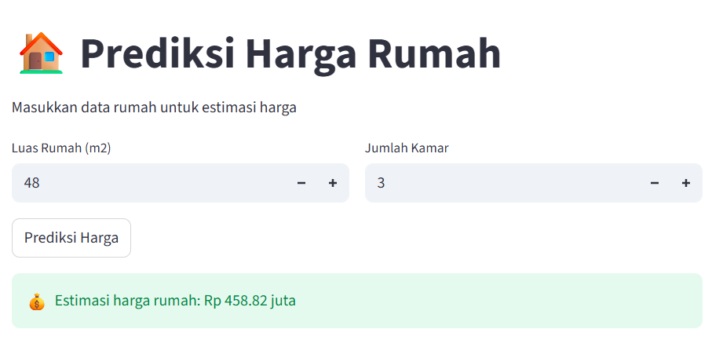

# 🏠 House Price Prediction (AI Web App)

## 📌 Overview

Aplikasi Machine Learning untuk memprediksi harga rumah berdasarkan fitur seperti luas dan jumlah kamar. Model ini dibangun menggunakan Python dan di-deploy sebagai web app menggunakan Streamlit.

---

## 🚀 Features

* Input data rumah (luas, jumlah kamar)
* Prediksi harga secara real-time
* Interface interaktif berbasis web
* Model evaluasi menggunakan MAE & RMSE

---

## 🧠 Machine Learning Pipeline

1. Load dataset dari CSV
2. Preprocessing (feature & target)
3. Split data (train/test)
4. Training model (Linear Regression)
5. Evaluasi model (MAE, RMSE)
6. Deployment menggunakan Streamlit

---

## 📊 Model Performance

* MAE: 7.35
* RMSE: 7.35

---

## ⚙️ Tech Stack

* Python
* Pandas
* Scikit-learn
* Streamlit

---

## 📷 App Preview



---

## ▶️ How to Run

```bash
python main.py
streamlit run app.py
```

---

## ⚠️ Limitations

* Dataset masih kecil
* Belum menggunakan banyak fitur
* Model masih bisa ditingkatkan

---

## 🚀 Future Improvements

* Menambahkan fitur (lokasi, umur rumah)
* Menggunakan model lebih kompleks (Random Forest)
* Deploy ke cloud (Streamlit Cloud)

---

## 👨‍💻 Author

Irma Nur Jayanti